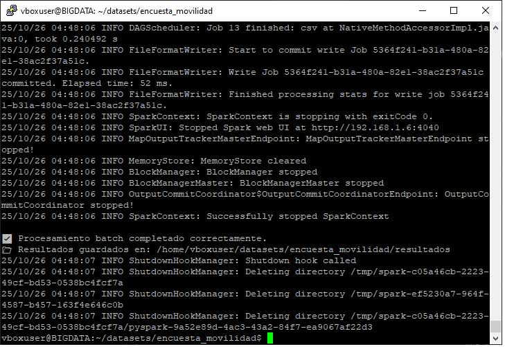
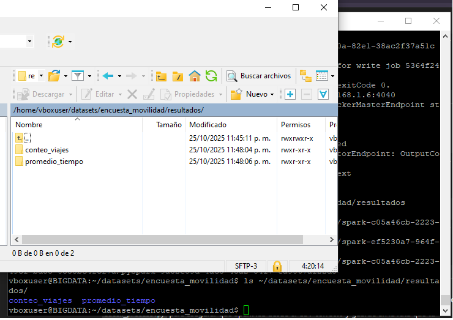
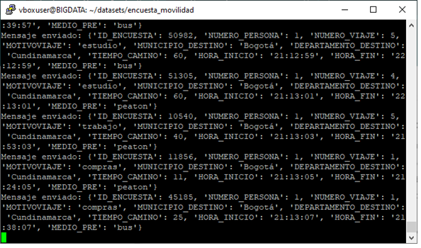
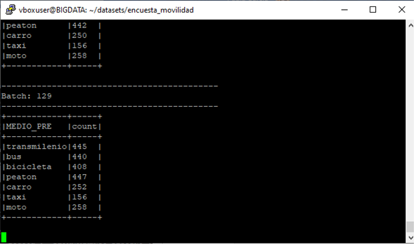
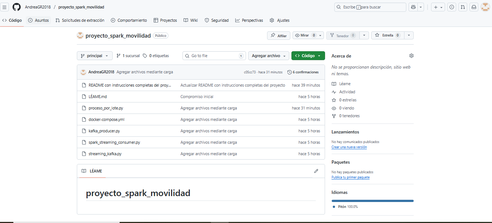

# 🚦 Análisis de Movilidad Bogotá con Spark y Kafka

## 📖 Introducción
Este proyecto analiza datos de movilidad en Bogotá utilizando **Apache Spark** y **Apache Kafka** para realizar procesamiento **batch** y **en tiempo real (streaming)**.  

El conjunto de datos contiene información sobre los medios de transporte utilizados por los ciudadanos en sus viajes diarios, permitiendo identificar patrones de desplazamiento, tiempos promedio y comportamientos de movilidad urbana.

---

## 🗺️ Definición del problema y conjunto de datos

El propósito del proyecto es **analizar los patrones de movilidad de los ciudadanos de Bogotá** a partir de encuestas sobre viajes, con el fin de identificar:

- Los **medios de transporte más utilizados**.  
- Los **horarios de mayor flujo de viajes**.  
- Los **tiempos promedio de desplazamiento** según el medio de transporte.  

El conjunto de datos utilizado proviene de la **Encuesta de Movilidad de Bogotá (Encuesta_movilidad.csv)**, disponible públicamente en **Kaggle** y en el portal de **Datos Abiertos de Colombia**.  

Columnas principales:
- `ID_ENCUESTA`: identificador del participante  
- `NUMERO_PERSONA`: persona dentro de la encuesta  
- `NUMERO_VIAJE`: número de viaje realizado  
- `MOTIVOVIAJE`: motivo del viaje (trabajo, estudio, ocio, etc.)  
- `MUNICIPIO_DESTINO`, `DEPARTAMENTO_DESTINO`: destino del viaje  
- `TIEMPO_CAMINO`: duración del viaje  
- `HORA_INICIO`, `HORA_FIN`: hora de inicio y fin del viaje  
- `MEDIO_PREDOMINANTE`: medio de transporte principal  

---

## ⚙️ Arquitectura de la solución

La arquitectura incluye los siguientes componentes principales:

- **Kafka 📨:** para la transmisión de mensajes en tiempo real.  
- **Spark Structured Streaming ⚙️:** para el procesamiento continuo de los datos recibidos desde Kafka.  
- **Python 🐍:** para generar los mensajes (productor) y procesarlos (consumidor).  
- **Hadoop y VirtualBox 🖥️:** entorno distribuido configurado dentro de una máquina virtual Ubuntu Server.  

---

## 📁 Archivos principales

| Archivo | Descripción |
|----------|-------------|
| `batch_process.py` | Realiza el análisis inicial del dataset en modo batch (limpieza, transformación y cálculo de promedios). |
| `kafka_producer.py` | Envía los registros del dataset al tópico de Kafka (`movilidad`). |
| `spark_streaming_consumer.py` | Consume los mensajes desde Kafka y los procesa en tiempo real con Spark Streaming. |
| `Encuesta_movilidad.csv` | Dataset base con la información de los registros. |

---

## 🚀 Procesamiento Batch (Apache Spark)

### 📌 Descripción
El procesamiento batch se encarga de analizar los datos históricos de movilidad en Bogotá.  
Permite identificar los medios de transporte más utilizados y los tiempos promedio de desplazamiento.

### ⚙️ Ejecución del script
cd ~/datasets/encuesta_movilidad
spark-submit batch_process.py

💡 Asegúrate de haber iniciado los servicios de Hadoop y configurado correctamente las variables de entorno de Spark antes de ejecutar el comando.

🧮 Proceso realizado
Carga del dataset desde un archivo CSV.

Limpieza y transformación de datos.

Agrupación y análisis de los viajes por medio de transporte.

Generación de resultados en consola y en archivos CSV.

📁 Resultados
Los resultados se almacenan en:
~/datasets/encuesta_movilidad/resultados/

🔁 Procesamiento en Tiempo Real (Streaming)
El procesamiento en tiempo real se realiza con Kafka + Spark Streaming, simulando la llegada de datos dinámicos.

Kafka Producer: (kafka_producer.py) envía los registros del dataset al tópico movilidad.

Spark Streaming Consumer: (spark_streaming_consumer.py) recibe los datos, calcula promedios y totales por tipo de transporte, y muestra resultados en consola.

▶️ Ejecución del proyecto

1️⃣ Iniciar Zookeeper y Kafka:
$KAFKA_HOME/bin/zookeeper-server-start.sh -daemon $KAFKA_HOME/config/zookeeper.properties
$KAFKA_HOME/bin/kafka-server-start.sh -daemon $KAFKA_HOME/config/server.properties

2️⃣ Ejecutar el productor:
python3 kafka_producer.py

3️⃣ Ejecutar el consumidor (Spark Streaming):
spark-submit spark_streaming_consumer.py

4️⃣ Detener los procesos:
Ctrl + C para detener el producer y consumer.
Cerrar Zookeeper y Kafka si es necesario.

📊 Visualización de resultados
Ejemplo de salida en tiempo real (Spark Streaming):

+-------------+-----------------+----------------+
| MEDIO_PRE   | PROMEDIO_TIEMPO | TOTAL_VIAJES  |
+-------------+-----------------+----------------+
| Transmilenio| 43.2            | 235            |
| Bus Urbano  | 39.7            | 204            |
| Bicicleta   | 27.1            | 128            |
| Peatón      | 25.3            | 226            |
| Automóvil   | 35.4            | 142            |
+-------------+-----------------+----------------+
📸 Evidencias del Proyecto
### 🧾 1. Procesamiento Batch 
Ejecución del script batch_process.py para procesar el conjunto de datos y generar los resultados agregados. 
 
--- 
### 📊 2. Resultados del Procesamiento Batch 
Visualización del archivo generado con los conteos por tipo de medio de transporte. 
 
--- 
### 🚀 3. Productor Kafka 
Enviando Datos Simulación del flujo de datos en tiempo real desde el productor hacia el tópico de Kafka. 
 
--- 
### ⚙️ 4. Spark Streaming en Ejecución 
Ejecución del proceso spark_streaming_consumer.py mostrando los resultados del análisis en tiempo real. 
 
--- 
### 💻 5. Repositorio en GitHub 
Estructura final del repositorio con el código fuente, scripts y documentación del proyecto. 
 
---

🧠 Conclusiones
El proyecto permitió integrar procesamiento batch y en tiempo real utilizando herramientas del ecosistema Big Data.
Se lograron identificar patrones de movilidad, tiempos promedio por transporte y horas pico, mostrando el potencial del análisis de datos masivos en la planificación urbana.

🧑‍💻 Autora
Proyecto desarrollado por:
Andrea Gordillo Rojas
Universidad Nacional Abierta y a Distancia (UNAD)
Curso: Big Data – 2025

🔗 Enlaces
📂 Repositorio del proyecto: GitHub - Proyecto Spark Movilidad
🎥 Video explicativo: Enlace pendiente
📑 Presentación del proyecto: Enlace pendiente
